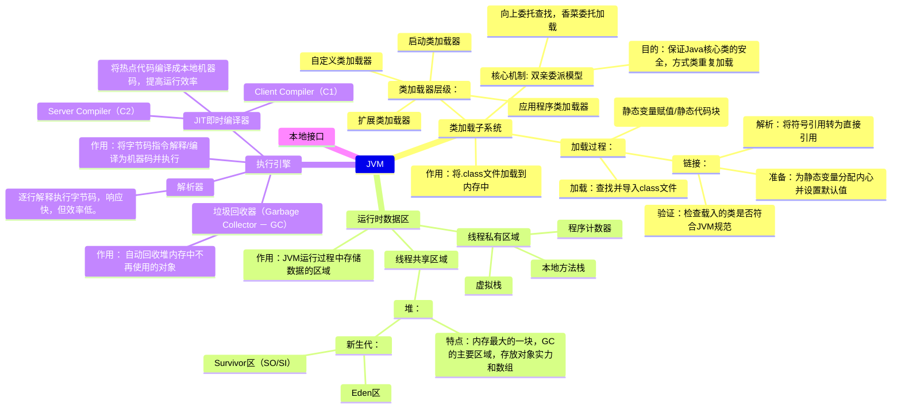

```mermaid
mindmap
    JVM
        类加载子系统
            作用：将.class文件加载到内存中
            加载过程：
                加载：查找并导入class文件
                链接：
                    验证：检查载入的类是否符合JVM规范
                    准备：为静态变量分配内心并设置默认值
                    解析：将符号引用转为直接引用
                初始化：执行类构造器<clinit>方法(静态变量赋值/静态代码块)
            类加载器层级：
                启动类加载器
                扩展类加载器
                应用程序类加载器
                自定义类加载器
            核心机制: 双亲委派模型
                向上委托查找，香菜委托加载
                目的：保证Java核心类的安全，方式类重复加载
        运行时数据区
            作用：JVM运行过程中存储数据的区域
            线程共享区域
                堆：
                    特点：内存最大的一块，GC的主要区域，存放对象实力和数组
                    新生代：
                        Eden区
                        Survivor区（SO/SI）
            线程私有区域
                虚拟栈
                本地方法栈
                程序计数器
        执行引擎
            作用：将字节码指令解释/编译为机器码并执行
            解析器
                逐行解释执行字节码，响应快，但效率低。
            JIT即时编译器
                将热点代码编译成本地机器码，提高运行效率
                Client Compiler（C1）
                Server Compiler（C2）
            垃圾回收器（Garbage Collector － GC）
                作用： 自动回收堆内存中不再使用的对象
                
        本地接口
        


```