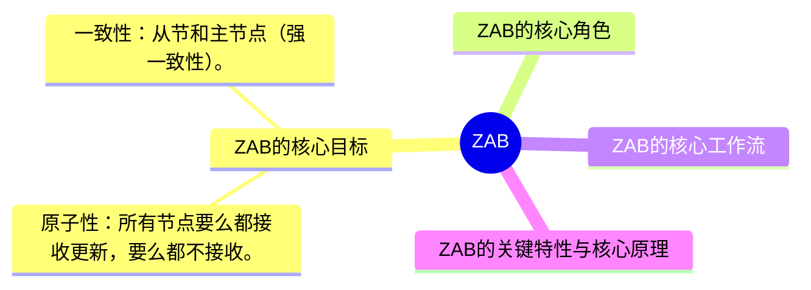

# ZAB 学习

# 0、ZAB（Zookeeper Atomic Broadcast）
ZAB是Zookeeper专用的原子广播协议，核心作用是保证分布式环境下数据的一致性和可靠性，本质是“主从复制＋原子广播”的结合体。

```mermaid
mindmap
    root((ZAB))
        ZAB的核心目标
            原子性：所有节点要么都接收更新，要么都不接收。
            一致性：从节和主节点（强一致性）。

        ZAB的核心角色
        ZAB的核心工作流
        ZAB的关键特性与核心原理
        
```