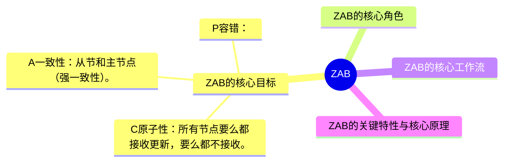
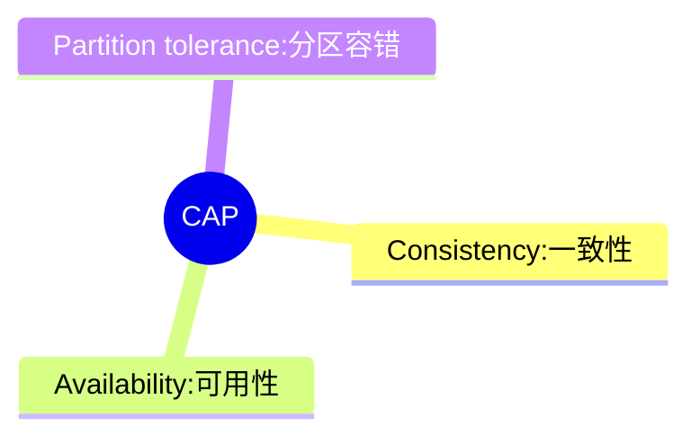

# ZAB 学习

# 0、ZAB（Zookeeper Atomic Broadcast）
ZAB是Zookeeper专用的原子广播协议，核心作用是保证分布式环境下数据的一致性和可靠性，本质是“主从复制＋原子广播”的结合体。

## 1、CAP(Zookeeper属于CP)

### 1.1 Consistency 一致性
- 核心含义： 所有节点在同一时刻看到的数据完全相同。

### 1.2 Availability 可用性
- 核心含义： 只要客户端的请求是合法的，系统几句必须在合理时间内返回明确结果（成功或失败），绝不出现“无响应”或“超时不返回”。

### 1.3 分区容错
- 核心含义： 当集群中部分节点因网络故障，宕机等原因与其他阶段断开连接（形成：“网络分区”）时，系统仍能正常提供服务，不会因分区而整体瘫痪。（所以CA是单机系统）

