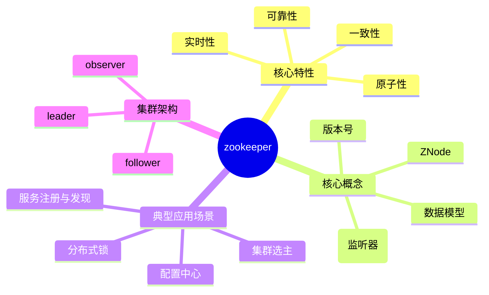

# ZK 的知识骨架

## 0、知识骨架

## 1、核心特性
ZK保证的是 强一致性。

ZK通过ZAB(Zookeeper Atomic Broadcast)协议来实现最终一致性。在ZAB协议中，Leader收到查过搬书Follower的ACK响应消息后，就会向所有Follower广播Commit消息，要求其提交事务。这意味着可能出现有的Follower已经Commit，但是有的Follower还没Commit的情况，此时不同客户端连接到不同Follower可能读到不一致的数据，但最终所有节点数据会达成一致。

此外，ZK的顺序一致性也有助于实现最终一致性。Leader会为每个事务Proposal分配一个全局唯一递增的事务ID（ZXID），并保证所有的Proposal按照ZXID的顺序同步到Follower，从而确保数据最终能够一致。

ZK的核心价值是由其四大特性支撑，这也是理解其应用场景的基础。

### 1.1 一致性
客户发起的更新请求，会按照发送顺序应用到ZK集群中，最终所有节点的数据达成一致。

### 1.2 原子性
更新操作只有两种结果，要么成功应用到所有节点，要么失败，不存在部分成功的中间态。

### 1.3 可靠性
一旦数据被成功写入并确认，后续客户端的读取请求都能获取这个最新的值，直到数据再次更新。

### 1.4 实时性
客户端能在合理时间内感知数据的变化，虽不保证毫秒级实时，但能满足分布式的协调需求。

## 2、核心概念
理解以下概念是掌握ZK工作原理的关键。

### 2.1 数据模型
采用类似于linux文件系统的树形结构，每个借点成为ZNode。ZNode不进能存储少量数据（默认1MB内），还能挂在子节点。

### 2.2 ZNode类型
根据生命周期氛围两类：
- 持久节点：创建后会一致存在，除非被客户但主动删除，适合存储长期有效数据（如服务地址）
- 临时节点：创建客户端与ZK断开连接后，节点会被自动删除，适合实现服务注册与发现（客户端下线即移除节点） 

### 2.3 版本号
每个ZNode有三个版本号，用于实现乐观锁机制，防止并发更新冲突。
- dataVersion: 数据内容的版本号，数据更新一次加1。
- cversion: 子节点的版本号，子节点新增/删除一次则加1。
- aclVersion: 节点权限（ACL）的版本号，权限修改一次加1。 

### 2.4 Watcher（监听器）
客户端可对ZNode注册监听，当节点数据或子节点发生变化时，ZK会主动向客户端推送事件通知，实现‘事件驱动’的协调逻辑。

## 3、典型应用场景
ZK的特性使其成为分布式系统的“基础设施”，常见应用场景包括：

### 3.1 配置中心
分布式系统的公共配置（如数据库地址，服务端口）存储在ZK的ZNode中，所有客户端监听该节点。配置更新时，ZK会通知所有客户端自动加载新配置，避免逐机修改。
### 3.2 服务注册与发现
服务提供者启动时，在ZK创建临时节点并写入服务地址；服务消费者监听该节点，获取所有在线服务的地址列表，实现动态调用。

### 3.3 分布式锁
利用ZK的ZNode唯一性和临时节点特性，多个客户端竞争创建同一个临时节点，成功创建这获得锁，释放锁时删除节点或断开连接让节点自动删除，解决分布式环境下资源竞争问题。

### 3.4 集群选主
集群中的节点通过竞争创建临时节点，成功创建这成为主节点；其他节点监听该节点，主节点故障时，监听事件触发，剩余节点重新竞争选主，保证集群高可用。（真的吗？）

## 4、集群架构
ZK通过集群不熟保证高可用，核心角色分为三类。
|角色|职责|特点|
|-|-|-|
|Leader|1 处理所有客户端的更新请求。  2 协调集群中各个节点的数据同步。|集群中唯一的Leader，故障后会触发重新选举。|
|Follower|1 处理客户端的读请求。 2 参与Leader选举投票 3 同步Leader的数据更新。|可扩展读性能，数据通常为奇数（如2，4个）？？？？|
|Observer|1 处理客户端读请求。 2 同步Leader的数据更新。 3 不参与Leader选举投票 |仅用于扩展读性能，不影响选举效率，适合读多写少的场景|