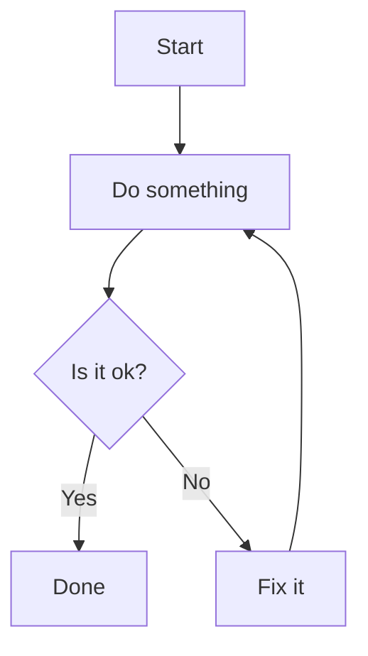

```vega
{
  "data": {
    "values": [
      {"x": 1, "y": 2},
      {"x": 2, "y": 3},
      {"x": 3, "y": 4}
    ]
  },
  "mark": "line",
  "encoding": {
    "x": {"field": "x", "type": "quantitative"},
    "y": {"field": "y", "type": "quantitative"}
  }
}
```