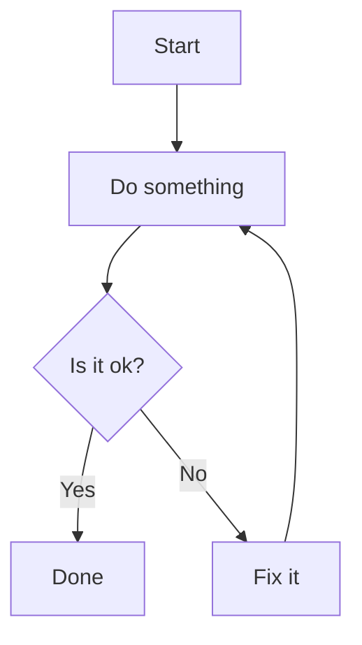

```vega
{
  "$schema": "https://vega.github.io/schema/vega-lite/v5.json",
  "description": "A simple scatter plot example",
  "data": {
    "values": [
      {"x": 1, "y": 28},
      {"x": 2, "y": 55},
      {"x": 3, "y": 43},
      {"x": 4, "y": 91},
      {"x": 5, "y": 81},
      {"x": 6, "y": 53},
      {"x": 7, "y": 19},
      {"x": 8, "y": 87},
      {"x": 9, "y": 52},
      {"x": 10, "y": 48}
    ]
  },
  "mark": "point",
  "encoding": {
    "x": {"field": "x", "type": "quantitative"},
    "y": {"field": "y", "type": "quantitative"}
  }
}

```