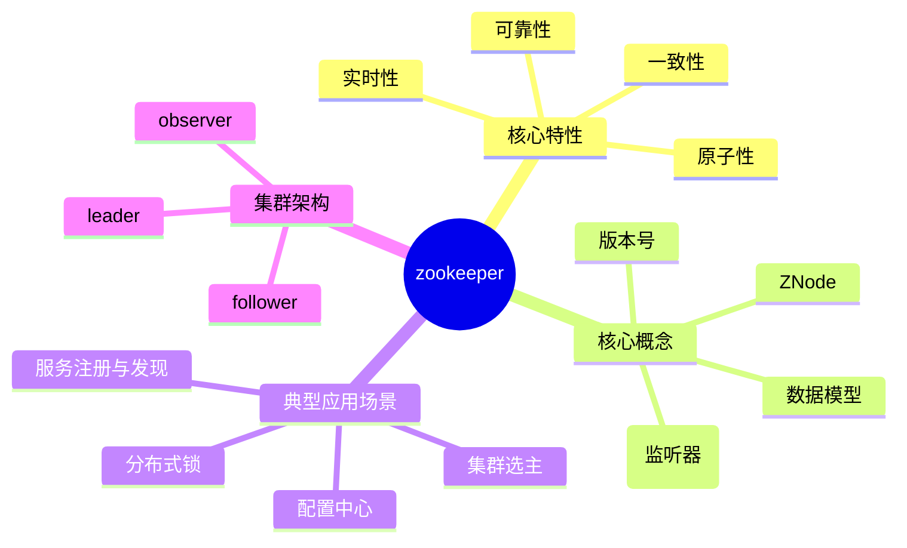

# ZK 的知识骨架

## 0、知识骨架

## 1、核心特性
ZK保证的是最终一致性。

ZK通过ZAB(Zookeeper Atomic Broadcast)协议来实现最终一致性。在ZAB协议中，Leader收到查过搬书Follower的ACK响应消息后，就会向所有Follower广播Commit消息，要求其提交事务。这意味着可能出现有的Follower已经Commit，但是有的Follower还没Commit的情况，此时不同客户端连接到不同Follower可能读到不一致的数据，但最终所有节点数据会达成一致。

此外，ZK的顺序一致性也有助于实现最终一致性。Leader会为每个事务Proposal分配一个全局唯一递增的事务ID（ZXID），并保证所有的Proposal按照ZXID的顺序同步到Follower，从而确保数据最终能够一致。

### 1.1 一致性
客户发起的更新请求，会按照发送顺序应用到ZK集群中，最终所有节点的数据达成一致。

### 1.2 原子性
更新操作只有两种结果，要么成功应用到所有节点，要么失败，不存在部分成功的中间态。

### 1.3 可靠性
一旦数据被成功写入并确认，后续客户端的读取请求都能获取这个最新的值，直到数据再次更新。

### 1.4 实时性
客户端能在合理时间内感知数据的变化，虽不保证毫秒级实时，但能满足分布式的协调需求。

## 2、核心概念

## 3、典型应用场景

## 4、集群架构