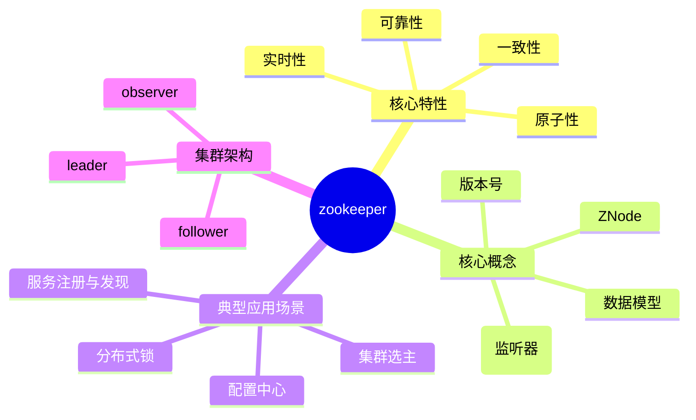

# ZK 的知识骨架

## 知识骨架

```mermaid
mindmap
  root((zookeeper))
    核心特性
      一致性
      原子性
      可靠性
      实时性
    核心概念
      数据模型
      ZNode
      版本号
      Watcher(监听器)
    典型应用场景
      配置中心
      服务注册与发现
      分布式锁
      集群选主
    集群架构
        leader
        follower
        observer
```

