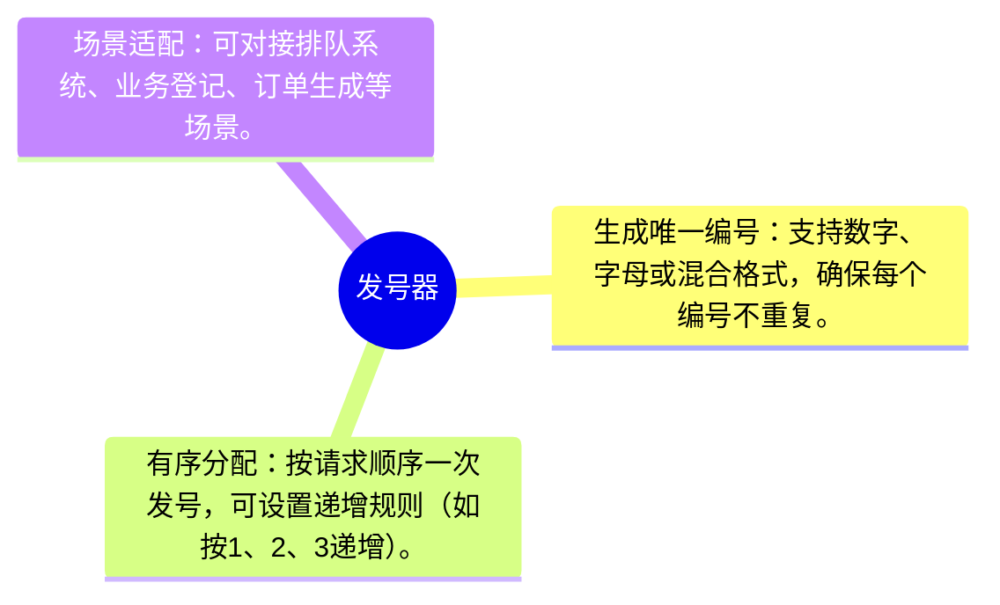
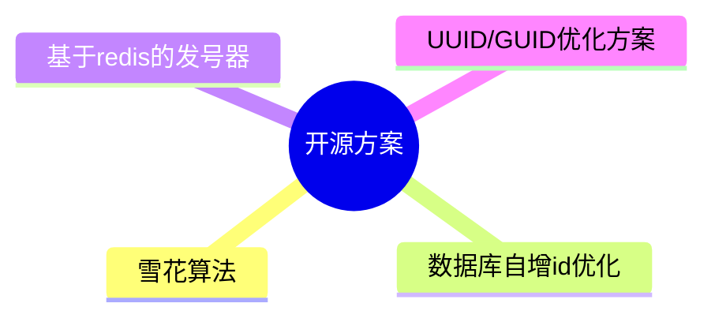

# 发号器

## 0、发号器是个什东西

发号器是用于有序分配唯一编号的工具/系统，核心作用是避免编号重复、保障流程规范。

## 1、开源社区优秀的发号器解决方案

### 1.1 雪花算法
- 核心原理：分布式系统中生成唯一ID的经典算法，64位ID包含时间戳、机器ID、序列号等部分，确保全局唯一且有序。
- 代表项目：
    - Twitter Snowflake(java): 最经典的宣化算法实现，适用于分布式服务。
    - Python-Snowflake: python语言的轻量级雪花算法库。
- 适用场景：分布式系统，高并发场景，需要快速生成唯一ID，且对ID有序星有一定要求。
### 1.2 数据库自增id优化
- 核心原理：基于数据库自增ID，通过分段，预分配等方式提升性能，避免单点瓶颈。
- 代表项目：
    - Leaf(java): 美团开源的分布式ID生成系统，支持号段模式和雪花算法模式，性能优异。
        - github: Meituan-Dianping/Leaf
    - TinyID(java): 京东开源的分布式ID生成器，基于有数据库号段模式，简单易用。
        - github: didi/tinyid
- 适用场景：中低并发场景，对ID生成的可用性和有序要求较高，且希望实现简单，维护成本低。
### 1.3 基于redis的发号器
- 核心原理：利用redis的原子性操作（如INCR、INCRBY）实现分布式环境下的唯一ID生成，支持灵活配置。
- 代表项目
    - Redis-ID-Generator(java): 基于Redis的分布式ID生成器，支持自定义前缀、步长、过期时间等。
        - github: hengyunabc/redis-id-generator
    - Distributed-ID-Genertaor(python): 轻量级Redis发号器，支持多业务先隔离。
        - github: 没找到

### 1.4 UUID/GUID优化方案
- 核心原理：基于UUID（通用唯一标识码）的变种，通过优化生成算法或结合业务信息，提升可读性和性能。
- 代表项目：
    - UUID-Generator(java): 支持多动UUID版本（如：v1，v4，v5），可自定义生成规则。
    - ShortUUID(python): 生成更短UUID（基于Bases62编码），适用于URL，文件名等场景。
        - skrorokithakis/shortuuid
- 适用场景：对ID唯一星要求极高，但无需有序性，且希望ID舞业务含义（如日志跟踪，分布式缓存键等）。

### 1.5 其他特色发号器
- Seata-ID(java): seata分布式事务框架中的id生成，支持雪花算法和UUID，轻量级可独立适用。
    - seata/seata (ID模块卫浴seata－common)
- IdGenerator(Gp): Go语言实现的分布式ID生成器，支持和虚化算法、号段模式、Redis模式、配置灵活。
    - github: yitter/idgenerator

## 选择建议
- 高并发＋有序性： 优先选择雪花算法（如twitter snowflake、leaf的雪花模式）
- 中低并发＋简单可靠： 选择数据库号段模式（如Leaf、TinyID）
- 超高性能＋灵活配置： 考虑Redis－based发号器（如Redis－ID－Generator）
- 无有序性要求＋高唯一性：适用UUID优化方案（如 java－id－generator，shortUUID）
