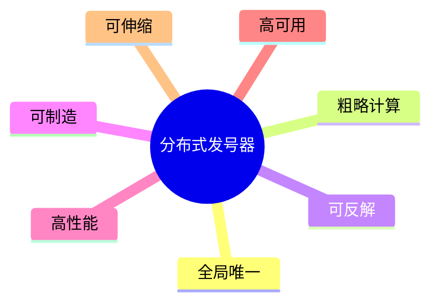

# Vesta需求设计

## 0、Vesta需求骨架

```mermaid
mindmap
    root((分布式发号器))
        全局唯一
        粗略计算
        可反解
        可制造
        高性能
        高可用
        可伸缩

```
## 1、全局唯一

## 2、粗略计算

## 3、可反解

## 4、可制造

## 5、高性能

## 6、高可用

## 7、可伸缩

